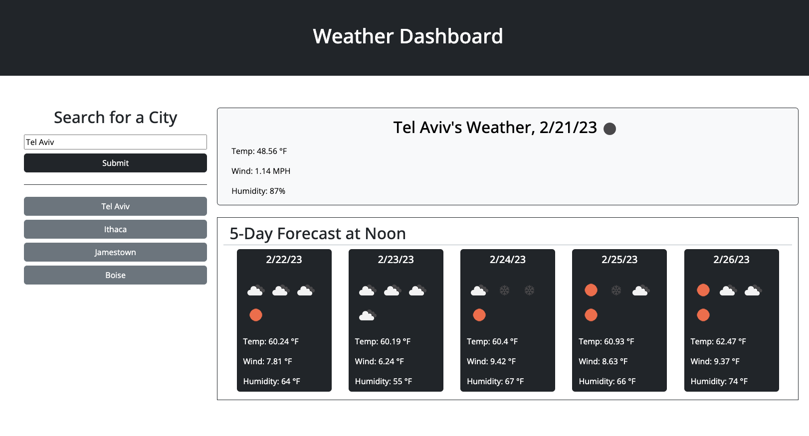

# <Your-Project-Title>

## Description

This Weather Dashboard allows a user to search by city name, find the current weather, as well a five-day forecast for weather conditions at 12pm. It allowed me to practice my abilities to fetch data from server-side APIs, and continued my practice in dynamically generating HTML content with Javascript. It also saves recent searches to local storage, though a future update may be to limit how many recent searches are displayed on page, and to conduct a check to make sure that items are not added to recent searches multiple times.

## Installation

No installations required!

## Usage

To use, please navigate [here](https://coldweatherboyy.github.io/weather-dashboard/) and enter cities where you'd like to know the weather! Your searches will be stored in your local storage.

## Credits

Conceptual guidance on Fetch functions and promises from [Antal Spector-Zabusky](https://gitlab.com/antalsz)
